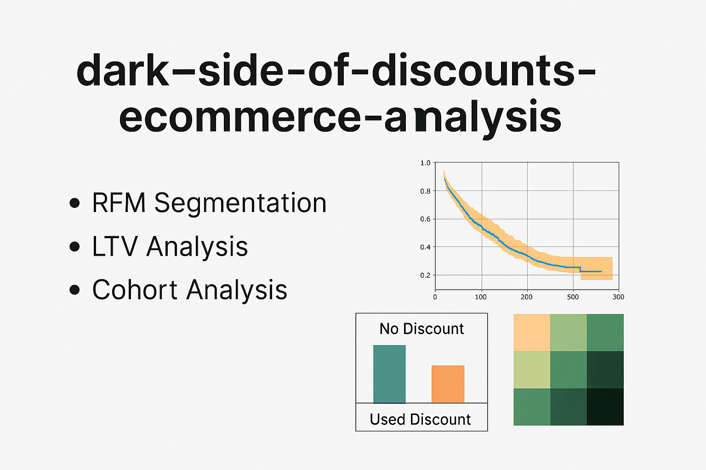

# dark-side-of-discounts-ecommerce-analysis
Exploring whether deep discounts hurt long-term revenue using RFM segmentation, LTV analysis, and cohort modeling.

**Can deep discounts hurt long-term revenue?**

This project explores whether discount-based customer acquisition results in lower lifetime value (LTV) and retention in e-commerce. It uses real-world data to run:

-  RFM Segmentation
-  LTV Comparison between discount vs. full-price customers
-  Cohort Analysis (retention over time)
-  Business Impact Recommendations

---

##  Tools Used
- Python (Pandas, NumPy)
- Data Visualization: Seaborn, Matplotlib
- Google Colab

---

## Key Insights

| Metric                        | Discount Customers | Non-Discount Customers |
|------------------------------|---------------------|------------------------|
| Avg. Monetary Value (LTV)    | Lower 📉             | Higher 📈              |
| Retention Over Months        | Drops Fast 📉        | More Stable 📈         |
| RFM Segments                 | At Risk, Hibernating | Champions, Loyal      |

---

## Business Recommendations

- Use **smart targeting** for discounts — avoid giving them to already loyal customers.
- Build **retention** with personalized journeys post-purchase.
- Consider **value-based offers** (e.g. free shipping) instead of deep price cuts.

---

## Project Structure
📁 dark-side-of-discounts/
├── The_Dark_Side_of_Discounts.ipynb
├── README.md

---
